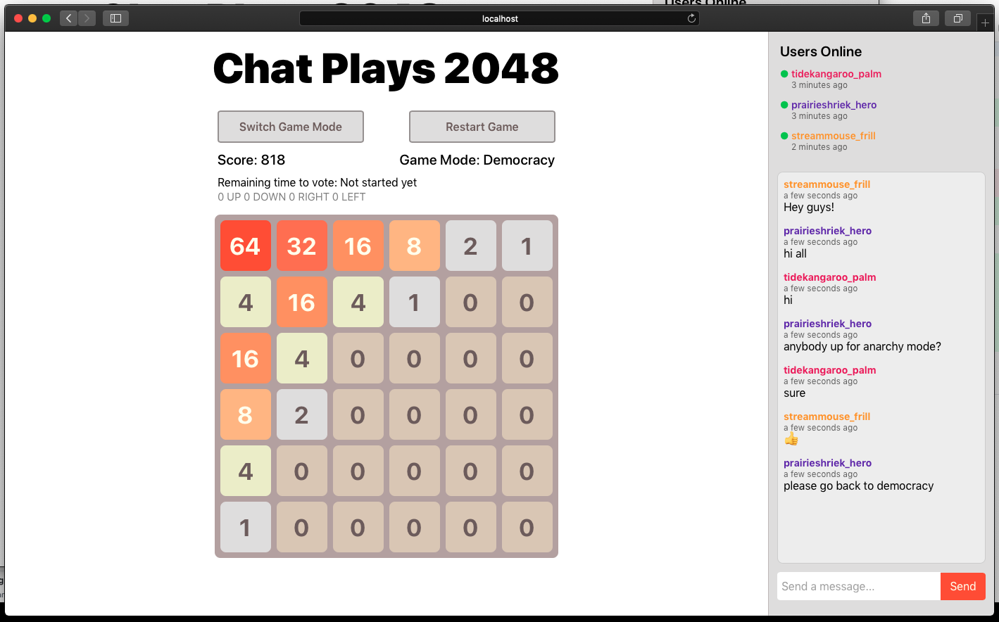

# Chat Plays 2048

It's a web app allowing two or more players to play on the same board at the same time. Kinda like Twitch Plays Pokemon.

## How to run

- Install dependencies
  - Node
  - Elixir
- Run `start_2048.sh`

# Features

- Multiplayer 2048 through websockets
- Anarchy and Democracy game modes
- Chat and online user tracking

## Backend

- I chose Elixir and Phoenix as the main stack. There's no database or ETS for backups at this time.

  - I think ETS would be a viable option, because with the BEAM VM we can afford to have a stateful web-servers thanks to the supervision tree
  - Phoenix provides great tools for websockets and we can also have user tracking out of the box

* For the game engine I forked a (lexmag/tty2048)[https://github.com/lexmag/tty2048] and modified it to my own needs. Modifications I made:

  - Removed some of the `GenEvent` implementation in favor for `GenServer` calls. It also made it easier to use.
  - Added an extra meta data - game stage (`:running`, `:game_won`, `:game_lost`)
  - Adjusted game settings like grid size, start tile value and min tile value to fit specs

- I wrote tests for the `GameServer` and for the Channels, but admittedly wasn't I wasn't able test it properly

## Frontend

- I chose React+Redux for the frontend, mainly because I work with it every day so I was able to move quickly.
- To handle websockets, I wrote a (`redux-middleware`)[https://redux.js.org/advanced/middleware/]. It's responsible for setting up the socket, joining channels, sending and receiving messages.

- For styling I used `styled-components`, a CSS-IN-JS lib. The website is not responsive. :(
- For testing I used `jest` and `@testing-library` mainly. They allow you to test components in a way that a user would, giving you more confidence it your tests. (I've set up and used Cypres.io before for end-to-end test, but it would be an overkill for this one.)
